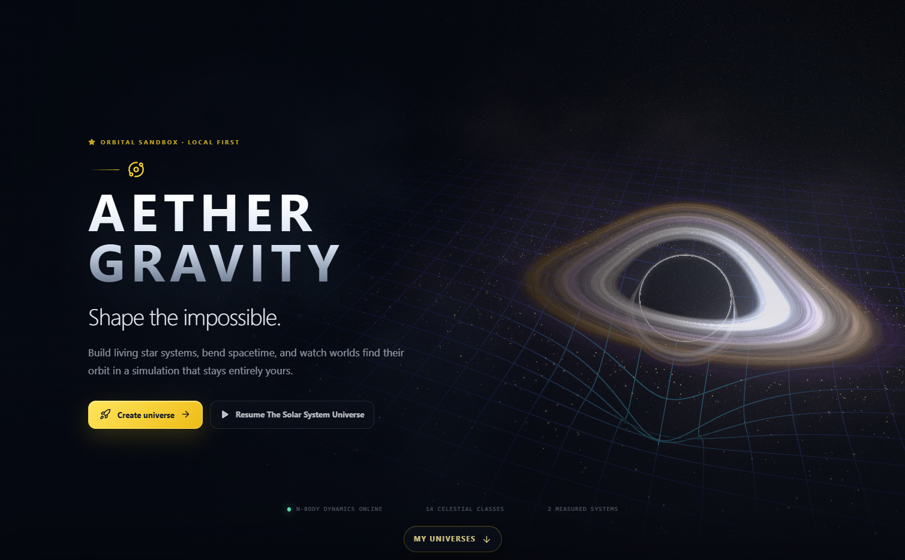
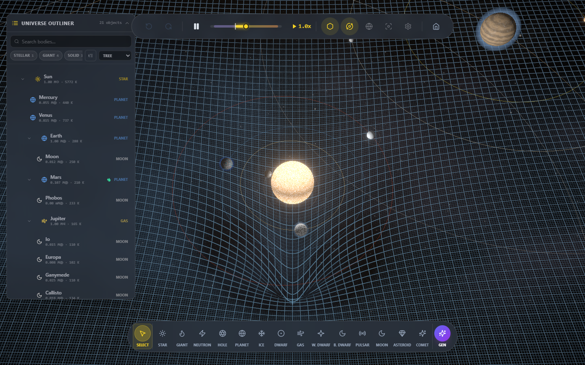
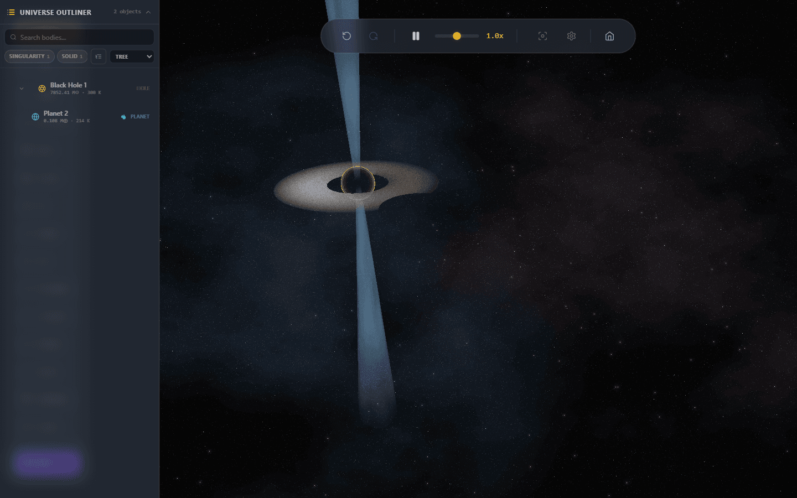
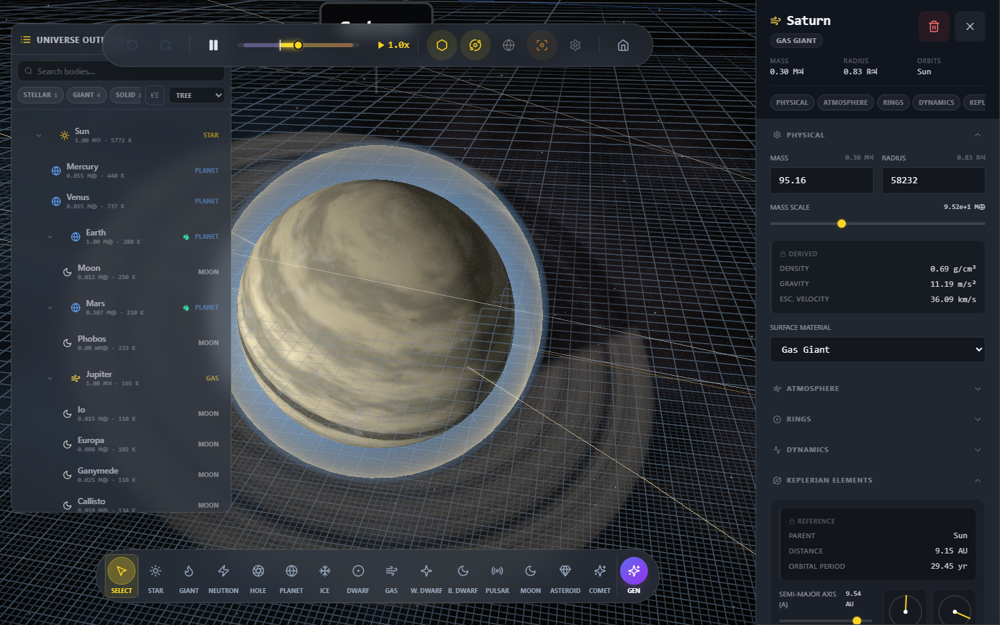
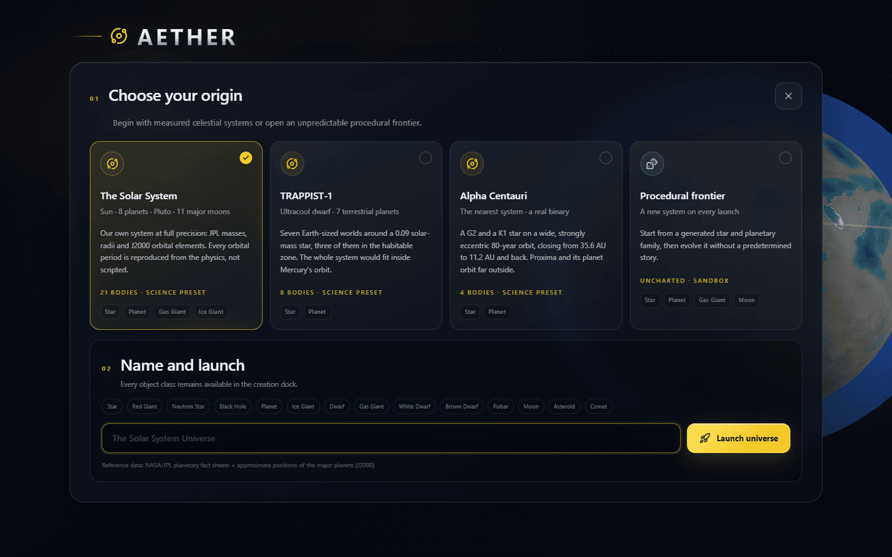
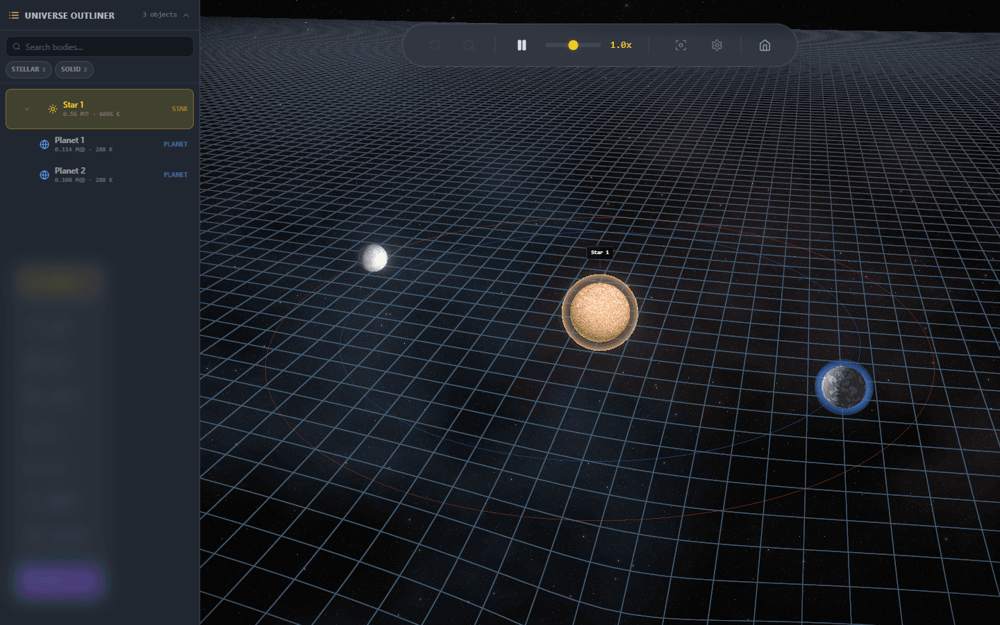
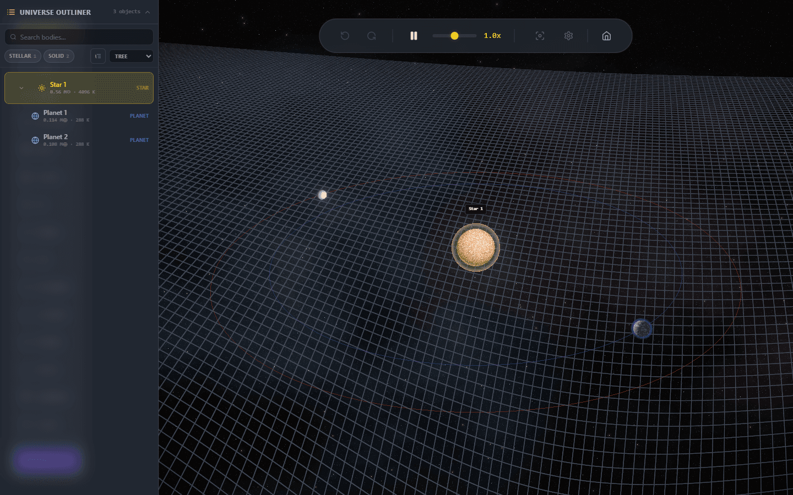
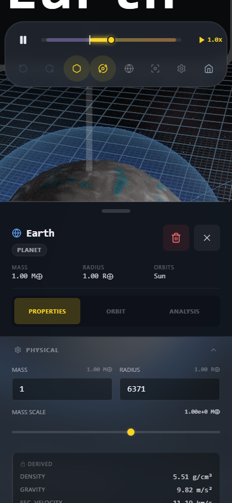

<div align="center">

# Aether Gravity

### An N-body orbital sandbox that takes the physics seriously

*Velocity-Verlet gravity in a derived unit system, relativistic black holes, and a precision-crafted UI — in the browser and on Android.*

[](https://react.dev/)
[](https://threejs.org/)
[](https://www.typescriptlang.org/)
[](https://vitejs.dev/)

[**Available on Google Play**](https://play.google.com/store/apps/details?id=com.aethergravity.app)



</div>

---

## Overview

**Aether Gravity** is a mobile-first space simulator built with **React**, **Three.js**, and custom **GLSL** shaders. It runs as a web app and ships to Android through Capacitor. You build star systems body by body, launch them with a slingshot gesture, and watch real gravity decide what happens next — stable resonances, slow orbital decay, mergers, supernovae, or a black hole that eats the neighbourhood.

The simulation is the point. Every quantity the app shows you — density, surface gravity, escape velocity, equilibrium temperature, orbital period — is computed from the body's actual mass and composition in a unit system derived from SI constants, not from a lookup table of nice-looking numbers.

Everything runs locally. The app makes **no network requests at all**: no accounts, no analytics, no ads, no crash reporting. Your universes live in your browser's storage or on your device.



### Core capabilities

| Area | What it actually does |
|------|------------------------|
| **N-body physics** | Velocity-Verlet symplectic integration on a fixed timestep, O(N²) pairwise forces with Newton's-third-law symmetry, Plummer softening derived from real body radii, and bounded energy drift verified in CI. |
| **A real unit system** | Masses in Earth masses, lengths in 0.025 AU, time in Julian years — with `G` derived from SI rather than tuned by hand. Physical radius and drawn radius are separate values, so nothing has to lie to stay visible. |
| **Relativistic black holes** | Kerr horizons, oblate ergospheres, ISCO and photon-sphere geometry, Novikov–Thorne disk efficiency, and gravitational redshift, with level-of-detail shaders and a lensing render target. |
| **Stellar evolution** | Mass-threshold reclassification against the real limits (deuterium burning, hydrogen burning, Chandrasekhar, TOV) and core-collapse supernovae above 8 M☉ leaving neutron-star or black-hole remnants. |
| **Measured presets** | The Solar System and TRAPPIST-1, built from published masses, radii, and orbital elements — plus a procedural generator when you want an unfamiliar sky. |
| **Universe sandbox** | 14 body classes, a nine-section Inspector, a searchable outliner, time control with reverse, undo/redo, and a local archive of saved worlds organised into folders. |

### Technical stack

- **Frontend:** React 18 · TypeScript 5.8 · Vite 6
- **Graphics:** Three.js 0.165 · React Three Fiber · Drei · custom GLSL
- **State:** Zustand
- **Styling:** Tailwind CSS
- **Mobile:** Capacitor 8 (`com.aethergravity.app`, minSdk 24, target SDK 36)
- **Haptics:** `@capacitor/haptics` (native vibration on Android, including the `VIBRATE` permission)
- **Testing:** Vitest · Playwright

---

## The physics

### Integration

The engine runs **Velocity-Verlet** — a symplectic, second-order, time-reversible integrator — on a **fixed timestep** of `1/1024` years (about 8.5 hours), with a catch-up accumulator capped at 8 steps per frame so a stalled tab cannot blow the simulation apart on resume. Accelerations are cached between the kick and the drift, and bodies live in Structure-of-Arrays `Float32Array` buffers, so a step allocates nothing.

Forces are the full O(N²) pairwise sum, each pair evaluated once and applied in both directions. Softening is **Plummer softening sized from the two bodies' real radii** rather than a magic constant, so close encounters stay finite without quietly changing the force law at scales that matter.

Because the integrator is time-symmetric, negative timesteps work: the speed control runs from **−2× to 4×**, and reversing time actually retraces the trajectory.

> Energy conservation is asserted, not assumed. `e2e/simulation.spec.ts` runs the three-body fixture for five seconds and fails the build if total energy drifts past a bound, and a dev-only diagnostics HUD samples kinetic and potential energy at 1 Hz while you play.

### Units

`utils/units.ts` defines the scale: **M\*** = 1 Earth mass, **L\*** = 0.025 AU, **T\*** = 1 Julian year, with the gravitational constant **derived from SI** in those units. Every displayed quantity follows from there:

- Bulk density, surface gravity, and escape velocity from mass and radius
- Roche limits and Hill spheres for the stability overlays
- A broken-power-law mass–luminosity relation and a ZAMS mass–radius relation for stars
- Stefan–Boltzmann effective temperature, and equilibrium temperature with albedo and a greenhouse term
- Kopparapu-style habitable-zone boundaries and an Earth Similarity Index

Physical size and drawn size are deliberately different fields. `radiusKm` is the truth; the rendered radius is a compressed mapping of it (√-compressed for solid bodies, ~23× compressed for stars, logarithmic for black holes) so that a star and an asteroid can share a frame.

### Mergers, evolution, and relativity

Collisions merge bodies at the barycentre with **exact momentum conservation**, retaining 99% of the combined mass and reporting the deficit as a gravitational-wave event. The remnant's type, radius, and geophysical properties are re-derived from its new mass rather than inherited.

Stars cross real thresholds: 13 Jupiter masses for deuterium burning, 0.075 M☉ for hydrogen burning, 1.4 M☉ (Chandrasekhar) and 2.2 M☉ (TOV) for degenerate remnants, and 8 M☉ for core collapse. Black hole spin is capped at the Thorne limit, a = 0.998.

Moons are propagated on **analytic Kepler rails** relative to their parent instead of joining the N-body sum — which is what keeps a 21-body Solar System with 11 major moons stable and fast — and are promoted to full N-body bodies the moment they escape the parent's Hill sphere.



> **Historical note:** [`PHYSICS_AUDIT.md`](./PHYSICS_AUDIT.md) is the engineering audit that motivated this work. It describes the *earlier* engine — semi-implicit Euler, an inconsistent unit system, partly-random property generation — and is kept as a record of what was fixed. Read it as history, not as documentation of current behaviour.

---

## What you can build

### 14 celestial classes

Star · Red Giant · Neutron Star · Black Hole · Planet · Ice Giant · Dwarf · Gas Giant · White Dwarf · Brown Dwarf · Pulsar · Moon · Asteroid · Comet

Each has a real mass range, its own shader treatment, and its own set of Inspector controls. Bodies are placed with a **slingshot gesture** — press to place, drag to aim, release to launch — and a system is capped at 50 bodies.

### Customisation

The Inspector separates **primaries** (the degrees of freedom you set) from **derived** values (recomputed and read-only), and groups them into nine sections:

| Section | Controls |
|---|---|
| **Physical** | Mass, radius, surface material, per-type stellar controls (metallicity, oblateness, convection, mass loss); derived density, gravity, escape velocity and orbital period |
| **Thermal** | Surface temperature; derived equilibrium temperature, spectral class and luminosity |
| **Composition** | Iron / silicate / water mass fractions, which drive density and therefore radius |
| **Atmosphere** | Density, scale height, haze, methane, cloud depth, and a derived atmospheric profile |
| **Rings** | Opacity and inner/outer edge in body radii, against a derived Roche limit |
| **Dynamics** | Axial tilt, and flare frequency / magnetic index for dwarfs |
| **Relativistic** | Kerr spin parameter and accretion rate; derived Schwarzschild radius, event horizon, photon sphere, ISCO and disk efficiency |
| **Keplerian elements** | Parent and distance, plus a, e, ν, i, Ω, ω — staged and applied together |
| **Habitability & tides** | Earth and rock similarity indices, habitability assessment, rotation period, synchronous rotation, and time to tidal lock |



### Measured systems

| Preset | Contents | Reference data |
|---|---|---|
| **The Solar System** | Sun, 8 planets, Pluto, 11 major moons | NASA/JPL planetary fact sheets, J2000 elements |
| **TRAPPIST-1** | Ultracool dwarf plus seven terrestrial planets | Agol et al. 2021 |
| **Procedural frontier** | A generated star and planetary family | — |

Orbital periods are reproduced by the physics, not scripted: load the Solar System, select Saturn, and the Inspector reads 29.45 years because that is what the integrator produces.



---

## Beginner and Advanced modes

The mode switch changes **presentation and pacing only**. It never changes the physics: the timestep, the forces, and the trajectories are identical in both modes, and switching mid-simulation is live and non-destructive.

| | Beginner | Advanced |
|---|---|---|
| **Time** | 0.35× base rate (~36 s per Earth year) | Full base rate (~12.5 s per Earth year) |
| **Body size** | Inflated for visibility — solids ×2.2, stars ×1.25, compact objects ×1.5 | True compressed scale |
| **Spacetime grid** | Exaggerated per-body wells so planets dent visibly, with depth shading | True summed Newtonian potential on one linear scale; only compact objects are log-compressed near their cores |
| **Creation dock** | 7 of the 14 classes | All 14 |
| **Inspector** | Advanced-audience fields hidden; Composition and Dynamics sections collapsed out | Every section |

<table>
<tr><td width="50%"><br><em>Beginner: inflated bodies, exaggerated wells</em></td>
<td width="50%"><br><em>Advanced: true scale, true-ratio potential, extra outliner controls</em></td></tr>
</table>

Existing bodies are never removed by a mode change — a pulsar you made in Advanced mode keeps working, keeps its Inspector entry, and stays saveable in Beginner mode. The preference is stored globally and seeded from whether you have finished the tutorial.

### Onboarding

A nine-step tutorial covers the model, navigation, the outliner, creation, orbits, the Inspector, stellar evolution, habitability, and the overlays; it is replayable from the main menu. On top of that, contextual helpers appear the first time you enter creation mode, open the Inspector, visit a tab, or create each body type.

---

## Interface

### Layout tiers

The HUD adapts across three tiers, defined once in `components/hooks/useMediaQuery.ts` and mirrored by the media queries in `index.css`:

| Tier | Width | Inspector | Outliner |
|------|-------|-----------|----------|
| **Phone** | `< 768` | Multi-detent bottom sheet — peek / half / full, draggable, back-button steps down | Bottom sheet; mutually exclusive with the inspector |
| **Tablet** | `768–1279` | Floating card with tabs | Floating card, top-left |
| **Desktop** | `≥ 1280` | Docked right rail (22rem), every section in one scroll | Docked left rail (18rem) |

On desktop the rails are real layout, not overlay: `--rail-left` / `--rail-right` inset the canvas container so the WebGL surface is never occluded.

<div align="center"></div>

### Design system

| Token | Hex | Role |
|-------|-----|------|
| **Void Navy** | `#10141C` | Primary background, chrome, and negative space |
| **Pulsar White** | `#F4F4FB` | Primary typography, accents, and high-contrast UI |

These are the web app shell's colours — set in `index.html` and as CSS variables — and they run through the UI components. Third-party themes and ad-hoc palette swaps are intentionally out of scope: the void is the brand. Hue is reserved for state; the primary/derived distinction in the Inspector is carried by structure and opacity instead.

### Motion

All motion is CSS (`@keyframes` in `index.css`) plus one frame-rate-independent camera tween in `utils/cameraFly.ts` — there is no animation library. Everything respects `prefers-reduced-motion`: a global suppression rule plus explicit JS fallbacks where CSS cannot reach (the camera snaps instead of easing, and derived-value flashes are disabled).

---

## Rendering

- **Pipeline:** React Three Fiber over Three.js 0.165, sRGB output, ACES Filmic tone mapping, device pixel ratio clamped to 2, and explicit WebGL context-loss and restore handling.
- **Device tiering:** gas layers, noise octaves, reflection resolution, dust count, orbit-path segments, and orbit refresh rate all scale to a detected device tier. Postprocessing is Bloom + Noise + Vignette on desktop, a single mipmap Bloom on capable mobile, and tone-mapping exposure compensation on the low tier.
- **Shaders:** a custom GLSL library covering planet surface, atmosphere, clouds, rings and terrain; star surfaces; neutron stars; relativistic accretion disks; Kerr event horizons; and ergospheres — plus the spacetime grid, shockwave, and supernova effects.
- **Level of detail:** black holes swap between high and low fragment paths with a separate lensing render target; planets use a quadtree-chunked sphere that splits on camera distance.
- **Precision:** a floating origin keeps the render-space coordinates small so large systems do not accumulate float error.
- **Overlays:** spacetime curvature grid, habitable zone, stability (Hill sphere / Roche limit), and orbit estimates — the last explicitly labelled as instantaneous two-body approximations rather than integrated paths.

---

## Privacy and storage

The app has **no backend and makes no network requests**. There is no `fetch`, `XMLHttpRequest`, `WebSocket`, or beacon anywhere in the application source, and `index.html` sets a strict Content-Security-Policy (`default-src 'self'`, `connect-src 'self'`, `object-src 'none'`, `form-action 'none'`) to keep it that way.

Worlds are saved to `localStorage` under the `aether:` key prefix, organised into folders, and autosaved every 30 seconds as well as when the app is backgrounded. Saved data is schema-versioned; the v1 → v2 unit migration uses a verified verbatim backup transactionally and removes it after the v2 save is validated. Everything loaded from storage is validated and clamped before it reaches the physics engine. Corruption, concurrent-tab changes, disabled storage, and quota failures preserve the prior save and surface a visible notice rather than silently losing data.

This matches the Play Store Data safety declaration: no data collected, no data shared.

---

## Local Installation

You may clone this repository and run it on your own machine for any non-commercial purpose. See [Legal & Licensing](#legal--licensing-notice) before sharing or publishing anything based on this code.

### Prerequisites

- **[Node.js](https://nodejs.org/) 18 or newer** and **npm**. CI runs on Node 22, which is the safest choice.
- A browser with **WebGL2**. The simulation will not start without it.
- Android work additionally needs JDK 21 and Android Studio — see [`ANDROID_BUILD.md`](./ANDROID_BUILD.md).

### 1. Clone the repository

```bash
git clone https://github.com/AntonisPsarras/aether-gravity.git
```

```bash
cd aether-gravity
```

### 2. Install dependencies

```bash
npm install
```

This also runs a `postinstall` step (`scripts/fix-proguard.js`) that patches the bundled Capacitor plugins to reference `proguard-android-optimize.txt`. It is harmless on a web-only checkout and required before an Android release build — see [`PROGUARD_FIX.md`](./PROGUARD_FIX.md).

### 3. Start the development server

```bash
npm run dev
```

Vite serves the app at **`http://127.0.0.1:3000`**.

### Commands

| Command | Description |
|---------|-------------|
| `npm run dev` | Development server on `127.0.0.1:3000` |
| `npm run build` | Type-check, then production build to `dist/` |
| `npm run typecheck` | `tsc --noEmit` on its own |
| `npm run preview` | Serve the production build locally |
| `npm test` | Vitest unit suites (`utils/**/*.test.ts`) |
| `npm run test:e2e` | Playwright end-to-end suites (`e2e/`) |
| `npm run test:e2e:ui` | Playwright in interactive UI mode |
| `npm run test:perf` | Frame-rate soak test only |
| `npm run android:init` | Add the Capacitor Android platform (first time only) |
| `npm run android:sync` | Build and sync the web assets into `android/` |
| `npm run android:open` | Open the Android project in Android Studio |
| `npm run android:run` | Build, sync, and run on a connected device |

### Common pitfalls

- **`localhost:3000` may not resolve.** The dev server binds to `127.0.0.1` specifically. Use the printed address.
- **Playwright needs its browser.** On a fresh clone, run `npx playwright install chromium` before `npm run test:e2e`. The suite starts and reuses its own dev server.
- **Headless environments need real GPU flags.** `playwright.config.ts` passes `--use-gl=angle --ignore-gpu-blocklist --enable-webgl`; a container without a GPU or an ANGLE fallback will fail the shader-compilation specs rather than the physics ones.
- **`npm run build` fails on type errors by design** — it runs `typecheck` first. Run `npm run typecheck` for the errors alone.

### Regenerating the screenshots

The images in this README are captured from the running app, not mocked up:

```bash
CAPTURE_SCREENSHOTS=1 npx playwright test e2e/screenshots.spec.ts --project=chromium
```

The spec skips itself without that environment variable, so it stays out of the normal suite and out of CI.

---

## Testing

- **Unit (Vitest — 24 suites, 338 tests, under `utils/`):** integrator fidelity and energy behaviour, unit-system self-consistency, orbital-element conversions, the Kepler solver, relativity formulas (Schwarzschild, Kerr, ISCO, photon sphere, disk efficiency, redshift), mass–radius and classification relations, habitability, all three real-system presets, input bounds, world storage and migration, display-mode gating, and onboarding state.
- **End-to-end (Playwright, `e2e/`):** smoke, simulation controls with a bounded energy-drift assertion, layout across breakpoints including a ≥44 px touch-target check, main menu and world creation, onboarding, inspector edit-locking against the physics sync, shader compilation and WebGL context loss/restore, and an FPS soak across four scene profiles.
- **CI:** `.github/workflows/playwright.yml` runs both suites on Node 22 for pushes to `main`, pull requests targeting any branch, and manual `workflow_dispatch`.

---

## Android

The Android app is the same web build wrapped in Capacitor 8 and published as `com.aethergravity.app`. [`ANDROID_BUILD.md`](./ANDROID_BUILD.md) covers the full path: toolchain setup, debug APK, keystore generation, signed AAB, device testing, and Play Console submission.

---

## Legal & Licensing Notice

> **This repository is source-available, not open source.**
> Licensed under the [PolyForm Strict License 1.0.0](https://polyformproject.org/licenses/strict/1.0.0) (`PolyForm-Strict-1.0.0`).

Copyright © 2026 Antonios Psarras. The full license text is in [`LICENSE`](./LICENSE).

This is **not** an [OSI-approved](https://opensource.org/licenses) open-source license (MIT, Apache, GPL, etc.). In short: you may use this software for any **non-commercial** purpose, but you may not **distribute** it or **make changes or new works** based on it.

### You may

- Download and keep a copy for yourself
- Read and study the source code
- Build and run the app on your own machines for **any noncommercial purpose** — research, experiment, testing for the benefit of public knowledge, personal study, private entertainment, hobby projects, amateur pursuits, or religious observance
- Use it inside a **noncommercial organization** — a charity, educational institution, public research organization, public safety or health organization, environmental protection organization, or government institution — regardless of how that organization is funded

### You may not

- **Redistribute** the software or any portion of it (uploads, mirrors, zip shares, public repos)
- **Modify** it or create derivative works, including private forks and patched builds
- **Publish** copies or variations to app stores, public hosting, or any distribution channel
- Use it for **commercial** purposes without a separate written agreement with the copyright holder
- **Sublicense or transfer** your license to anyone else

### Also worth knowing

- **Patent license.** The license grants a patent license alongside the copyright license. It ends immediately if you (or your company) claim in writing that the software infringes a patent.
- **Fair use is untouched.** Whatever fair-use rights you have under law are not limited by these terms.
- **Violations have a cure window.** The first time you are notified in writing of a violation, your licenses can continue if you come into full compliance and correct past violations within 32 days. Otherwise they end immediately.
- **No warranty, no liability.** The software is provided as is, as far as the law allows.

**Cloning this repository does not grant permission to republish or fork it.** Share what you learned in your own words — do not ship this codebase, or a modified version of it, to others.

> This section is a plain-English summary for orientation only. It is **not** the license and it is not legally binding. [`LICENSE`](./LICENSE) is the controlling text; where the two differ, `LICENSE` governs.

Third-party dependencies remain under their own licenses. For commercial licensing or other permissions, contact the repository owner via the official project channels.

---

<div align="center">

*Built for space enthusiasts who care about physics, performance, and craft.*

**© 2026 Antonios Psarras. All rights reserved.**

</div>
